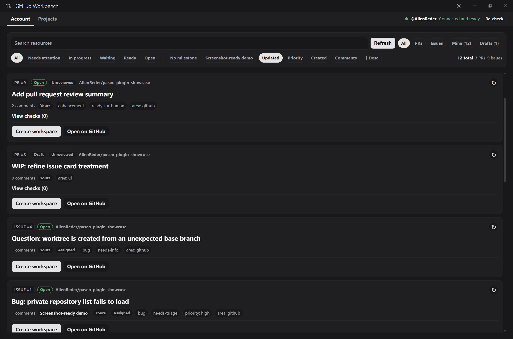
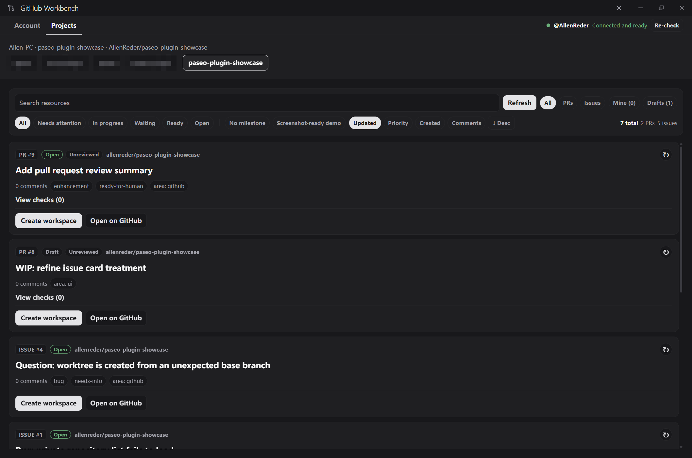

# Paseo GitHub Workbench

GitHub Workbench is a [Paseo](https://github.com/getpaseo/paseo) plugin for
working with GitHub issues and pull requests without leaving Paseo.

It gathers resources from your account or a selected repository, shows their
GitHub state in a compact workbench, and can create or reopen a corresponding
Paseo workspace for an issue or pull request.

## Screenshots

### Account workbench

### Project workbench

## What it does

- Lists open GitHub issues and pull requests for an account or repository.
- Shows labels, assignees, milestones, comments, review decisions, mergeability,
  and check status.
- Refreshes individual resources and reports authentication, rate-limit, and
  GitHub CLI failures clearly.
- Opens GitHub links in the system browser.
- Creates or reuses local workspaces and Git worktrees for issues and pull
  requests.
- Provides a global workbench, a project panel, and Command Center entries.
- Supports English and Simplified Chinese.

## Requirements

- Paseo 0.7 or newer.
- [GitHub CLI](https://cli.github.com/) (gh) installed on the machine running
  the Paseo daemon.
- gh auth login completed for the GitHub account whose resources you want to
  see. Accessing private repositories requires a token with the corresponding
  repository permissions.
- Git installed for workspace and worktree actions.

## Install

Install directly from GitHub:

    paseo plugin add AllenReder/paseo-github-workbench --ref main

Then open Paseo's plugin settings, enable plugins if necessary, and enable
**GitHub Workbench**. Plugins are trusted code: its server side runs on the
Paseo daemon host and can invoke gh and git with that user's permissions.

To inspect its lifecycle or update a tracked installation:

    paseo plugin status
    paseo plugin logs paseo-github-workbench
    paseo plugin update paseo-github-workbench

For local development, clone this repository, install its development
dependencies with Bun, run the checks below, and install the directory source
with the Paseo CLI:

    bun install --frozen-lockfile
    bun run check
    bun run typecheck
    bun run test
    paseo plugin install /absolute/path/to/paseo-github-workbench

## Development

    bun run check
    bun run typecheck
    bun run test

The plugin's public host contracts are represented locally by
paseo-plugin.d.ts. Regenerate that file with the matching Paseo CLI when
updating the supported Paseo version.

## Security

See [SECURITY.md](SECURITY.md) before reporting a vulnerability. Do not include
tokens, private repository contents, or personal data in public issues.

## Contributing

Bug reports, focused improvements, and documentation fixes are welcome. Read
[CONTRIBUTING.md](CONTRIBUTING.md) first.

## License

Apache-2.0. See [LICENSE](LICENSE).
