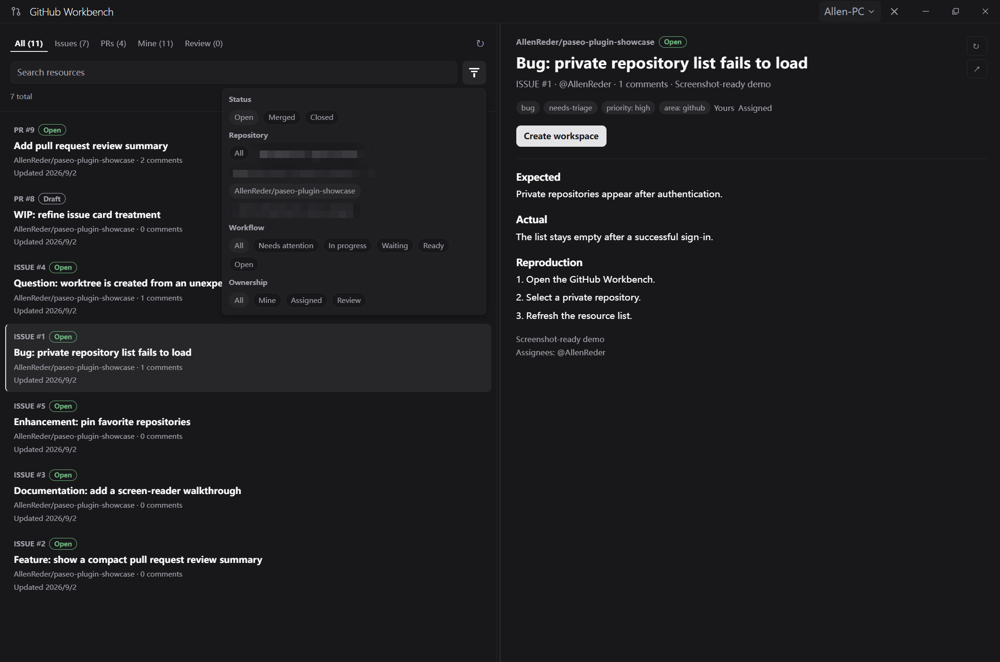

# Paseo GitHub Workbench

[English](README.md) | [简体中文](README.zh-CN.md)

GitHub Workbench 是一个 [Paseo](https://github.com/getpaseo/paseo) 插件，让你无需离开 Paseo，即可处理 GitHub Issue 和拉取请求（Pull Request）。

它会汇集你的账户或所选仓库中的资源，以紧凑的工作台形式展示 GitHub 状态；并能为某个 Issue 或拉取请求创建或重新打开对应的 Paseo 工作区。

## 截图

## 界面与布局

响应式深色工作台采用类似 Codex 的双栏设计：左侧面板列出 GitHub Issue 和拉取请求，右侧面板展示所选资源的元数据、正文描述以及关联的详细信息。在宽屏布局下，默认采用 1:1 等分比例，并可通过拖动可见的分隔线在 30% 至 70% 之间调整列表宽度；在紧凑布局下，点击资源将直接打开详情面板，并提供返回列表的快捷操作。

你可以通过顶部的“全部”、“Issue”、“PR”、“我的”和“评审”标签快速切换列表范围。筛选菜单支持按 GitHub 状态（未关闭、已合并、已关闭）、GitHub 仓库、工作流阶段及归属关系进行精确过滤。详情面板操作可一键打开对应的现有 Paseo 工作区，或按需新建工作区。
## 功能

- 列出某个账户或仓库中处于打开状态的 GitHub Issue 和拉取请求。
- 显示标签、指派人、里程碑、评论、审查结论、可合并性和检查状态。
- 支持刷新单个资源，并清晰提示身份验证、速率限制及 GitHub CLI 失败问题。
- 在系统浏览器中打开 GitHub 链接。
- 为 Issue 和拉取请求创建或复用本地工作区与 Git worktree。
- 提供全局工作台、项目面板和 Command Center 入口。
- 支持英文和简体中文。

## 环境要求

- Paseo 0.7 或更高版本。
- 推荐：在运行 Paseo 守护进程的机器上设置 `GH_TOKEN`（或 `GITHUB_TOKEN`）。插件会直接调用 GitHub GraphQL API，无需安装 GitHub CLI；令牌需要具备访问目标仓库的权限。
- 或者：在 Paseo 守护进程宿主机上安装 [GitHub CLI](https://cli.github.com/)（`gh`），并完成 `gh auth login`。这是无需额外配置令牌的兼容方案。
- 已安装 Git，以使用工作区和 worktree 功能。

## 已知限制

- GitHub Workbench 仅支持 GitHub；暂不支持其他代码托管平台。

## 安装

直接从 GitHub 安装：

    paseo plugin add AllenReder/paseo-github-workbench --ref main

然后打开 Paseo 的插件设置：如有需要先启用插件功能，再启用 **GitHub Workbench**。插件属于受信任代码：其服务端代码会在 Paseo 守护进程宿主机上运行，并可访问 `GH_TOKEN`/`GITHUB_TOKEN`，或使用该用户的权限调用 `gh` 和 `git`。

查看插件状态、日志或更新已跟踪的安装：

    paseo plugin status
    paseo plugin logs paseo-github-workbench
    paseo plugin update paseo-github-workbench

本地开发时，克隆本仓库，用 Bun 安装开发依赖并运行以下检查；随后使用 Paseo CLI 安装目录源码：

    bun install --frozen-lockfile
    bun run check
    bun run typecheck
    bun run test
    paseo plugin install /absolute/path/to/paseo-github-workbench

## 开发

    bun run check
    bun run typecheck
    bun run test

插件公开的宿主契约在本地由 `paseo-plugin.d.ts` 表示。升级所支持的 Paseo 版本时，请使用匹配版本的 Paseo CLI 重新生成该文件。

## 安全

报告漏洞前请先阅读 [SECURITY.md](SECURITY.md)。请勿在公开 Issue 中包含令牌、私有仓库内容或个人数据。

## 贡献

欢迎提交错误报告、有针对性的改进与文档修复。请先阅读 [CONTRIBUTING.md](CONTRIBUTING.md)。

## 许可证

Apache-2.0。详见 [LICENSE](LICENSE)。
